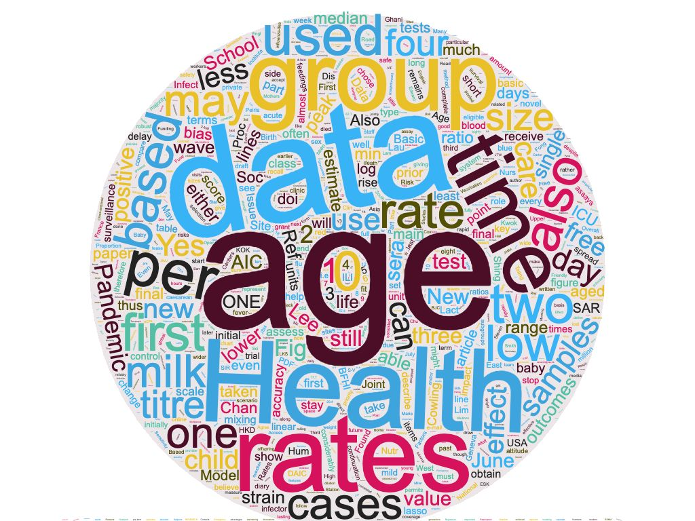

```{r setup, include=FALSE}
knitr::opts_chunk$set(echo = TRUE)
```

---


# About
Dr. Kendra M. Wu is an engineer turned theoretical epidemiologist. She is currently a Postdoctoral Researcher in Statistical/ Mathematical Modelling of Infectious Diseases at the [Centre for Tropical Medicine and Global Health](https://www.tropicalmedicine.ox.ac.uk) of [Nuffield Department of Clinical Medicine](https://www.ndm.ox.ac.uk), [University of Oxford](http://www.ox.ac.uk), where she uses mathematics and statsistics to study infectious disease outbreaks in low and middle income countries (LMICs). 

Here is a word cloud generated from the text of her publications:



# Research Interests
* Infectious disease epidemiology and control
* Outbreak analysis and response
* Emerging infections
* Disease transmission dynamics
* Mathematical modelling
* Evolution of pathogens
* Global health

# Current Project
* ADAGIO